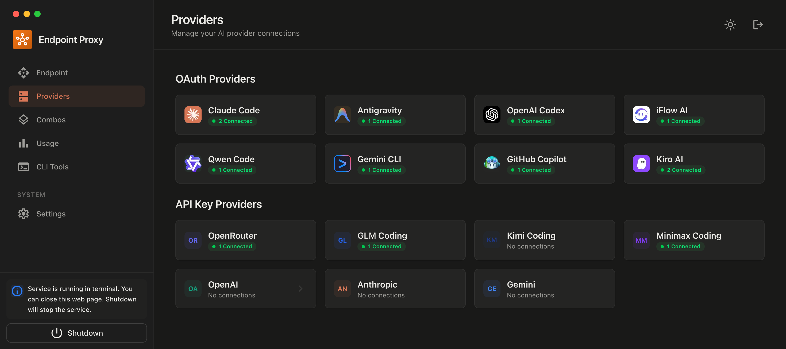

<div align="center">
  
  
  # OmniRoute - Free AI Router
  
  **Never stop coding. Auto-route to FREE & cheap AI models with smart fallback.**
  
  **36+ Providers • Embeddings • Image Generation • Audio • Reranking • Full TypeScript**
  
  **Free AI Provider for OpenClaw.**
  
  <p align="center">
    
  </p>
  
  > *This project is inspired by and originally forked from [9router](https://github.com/decolua/9router) by [decolua](https://github.com/decolua). Thank you for the incredible foundation!*
  
  [](https://www.npmjs.com/package/omniroute)
  [](https://hub.docker.com/r/diegosouzapw/omniroute)
  [](https://github.com/diegosouzapw/OmniRoute/blob/main/LICENSE)
  [](https://omniroute.online)
  
  [🌐 Website](https://omniroute.online) • [🚀 Quick Start](#-quick-start) • [💡 Features](#-key-features) • [📖 Docs](#-documentation)
</div>

---

## 🤔 Why OmniRoute?

**Stop wasting money and hitting limits:**

- ❌ Subscription quota expires unused every month
- ❌ Rate limits stop you mid-coding
- ❌ Expensive APIs ($20-50/month per provider)
- ❌ Manual switching between providers

**OmniRoute solves this:**

- ✅ **Maximize subscriptions** - Track quota, use every bit before reset
- ✅ **Auto fallback** - Subscription → Cheap → Free, zero downtime
- ✅ **Multi-account** - Round-robin between accounts per provider
- ✅ **Universal** - Works with Claude Code, Codex, Gemini CLI, Cursor, Cline, any CLI tool

---

## 🔄 How It Works

```
┌─────────────┐
│  Your CLI   │  (Claude Code, Codex, Gemini CLI, OpenClaw, Cursor, Cline...)
│   Tool      │
└──────┬──────┘
       │ http://localhost:20128/v1
       ↓
┌─────────────────────────────────────────┐
│           OmniRoute (Smart Router)        │
│  • Format translation (OpenAI ↔ Claude) │
│  • Quota tracking + Embeddings + Images │
│  • Auto token refresh                   │
└──────┬──────────────────────────────────┘
       │
       ├─→ [Tier 1: SUBSCRIPTION] Claude Code, Codex, Gemini CLI
       │   ↓ quota exhausted
       ├─→ [Tier 2: API KEY] DeepSeek, Groq, xAI, Mistral, Together, etc.
       │   ↓ budget limit
       ├─→ [Tier 3: CHEAP] GLM ($0.6/1M), MiniMax ($0.2/1M)
       │   ↓ budget limit
       └─→ [Tier 4: FREE] iFlow, Qwen, Kiro (unlimited)

Result: Never stop coding, minimal cost
```

---

## ⚡ Quick Start

**1. Install globally:**

```bash
npm install -g omniroute
omniroute
```

🎉 Dashboard opens at `http://localhost:20128`

| Command                 | Description                       |
| ----------------------- | --------------------------------- |
| `omniroute`             | Start server (default port 20128) |
| `omniroute --port 3000` | Use custom port                   |
| `omniroute --no-open`   | Don't auto-open browser           |
| `omniroute --help`      | Show help                         |

**2. Connect a FREE provider:**

Dashboard → Providers → Connect **Claude Code** or **Antigravity** → OAuth login → Done!

**3. Use in your CLI tool:**

```
Claude Code/Codex/Gemini CLI/OpenClaw/Cursor/Cline Settings:
  Endpoint: http://localhost:20128/v1
  API Key: [copy from dashboard]
  Model: if/kimi-k2-thinking
```

**That's it!** Start coding with FREE AI models.

**Alternative — run from source:**

```bash
cp .env.example .env
npm install
PORT=20128 NEXT_PUBLIC_BASE_URL=http://localhost:20128 npm run dev
```

---

## 🐳 Docker

OmniRoute is available as a public Docker image on [Docker Hub](https://hub.docker.com/r/diegosouzapw/omniroute).

**Quick run:**

```bash
docker run -d \
  --name omniroute \
  --restart unless-stopped \
  -p 20128:20128 \
  -v omniroute-data:/app/data \
  diegosouzapw/omniroute:latest
```

**With environment file:**

```bash
# Copy and edit .env first
cp .env.example .env

docker run -d \
  --name omniroute \
  --restart unless-stopped \
  --env-file .env \
  -p 20128:20128 \
  -v omniroute-data:/app/data \
  diegosouzapw/omniroute:latest
```

**Using Docker Compose:**

```bash
# Base profile (no CLI tools)
docker compose --profile base up -d

# CLI profile (Claude Code, Codex, OpenClaw built-in)
docker compose --profile cli up -d
```

| Image                    | Tag      | Size   | Description           |
| ------------------------ | -------- | ------ | --------------------- |
| `diegosouzapw/omniroute` | `latest` | ~250MB | Latest stable release |
| `diegosouzapw/omniroute` | `0.8.8`  | ~250MB | Current version       |

---

## 💡 Key Features

### 🧠 Core Routing & Intelligence

| Feature                         | What It Does                                                                   |
| ------------------------------- | ------------------------------------------------------------------------------ |
| 🎯 **Smart 4-Tier Fallback**    | Auto-route: Subscription → API Key → Cheap → Free                              |
| 📊 **Real-Time Quota Tracking** | Live token count + reset countdown per provider                                |
| 🔄 **Format Translation**       | OpenAI ↔ Claude ↔ Gemini ↔ Cursor ↔ Kiro seamless                              |
| 👥 **Multi-Account Support**    | Multiple accounts per provider with intelligent selection                      |
| 🔄 **Auto Token Refresh**       | OAuth tokens refresh automatically with retry                                  |
| 🎨 **Custom Combos**            | 6 strategies: fill-first, round-robin, p2c, random, least-used, cost-optimized |
| 🧩 **Custom Models**            | Add any model ID to any provider                                               |
| 🌐 **Wildcard Router**          | Route `provider/*` patterns to any provider dynamically                        |
| 🧠 **Thinking Budget**          | Passthrough, auto, custom, and adaptive modes for reasoning models             |
| 💬 **System Prompt Injection**  | Global system prompt applied across all requests                               |
| 📄 **Responses API**            | Full OpenAI Responses API (`/v1/responses`) support for Codex                  |

### 🎵 Multi-Modal APIs

| Feature                    | What It Does                                        |
| -------------------------- | --------------------------------------------------- |
| 🖼️ **Image Generation**    | `/v1/images/generations` — 4 providers, 9+ models   |
| 📐 **Embeddings**          | `/v1/embeddings` — 6 providers, 9+ models           |
| 🎤 **Audio Transcription** | `/v1/audio/transcriptions` — Whisper-compatible     |
| 🔊 **Text-to-Speech**      | `/v1/audio/speech` — Multi-provider audio synthesis |
| 🛡️ **Moderations**         | `/v1/moderations` — Content safety checks           |
| 🔀 **Reranking**           | `/v1/rerank` — Document relevance reranking         |

### 🛡️ Resilience & Security

| Feature                         | What It Does                                                  |
| ------------------------------- | ------------------------------------------------------------- |
| 🔌 **Circuit Breaker**          | Auto-open/close per-provider with configurable thresholds     |
| 🛡️ **Anti-Thundering Herd**     | Mutex + semaphore rate-limit for API key providers            |
| 🧠 **Semantic Cache**           | Two-tier cache (signature + semantic) reduces cost & latency  |
| ⚡ **Request Idempotency**      | 5s dedup window for duplicate requests                        |
| 🔒 **TLS Fingerprint Spoofing** | Bypass TLS-based bot detection via wreq-js                    |
| 🌐 **IP Filtering**             | Allowlist/blocklist for API access control                    |
| 📋 **Compliance Audit Log**     | Tamper-proof request logs with opt-out per API key            |
| 📊 **Editable Rate Limits**     | Configurable RPM, min gap, and max concurrent at system level |

### 📊 Observability & Analytics

| Feature                      | What It Does                                                    |
| ---------------------------- | --------------------------------------------------------------- |
| 📝 **Request Logging**       | Debug mode with full request/response logs                      |
| 💾 **SQLite Proxy Logs**     | Persistent proxy logs survive server restarts                   |
| 📊 **Analytics Dashboard**   | Recharts-powered: stat cards, model usage chart, provider table |
| 📈 **Progress Tracking**     | Opt-in SSE progress events for streaming                        |
| 🧪 **LLM Evaluations**       | Golden set testing with 4 match strategies                      |
| 🔍 **Request Telemetry**     | p50/p95/p99 latency aggregation + X-Request-Id tracing          |
| 📋 **Request Logs + Quotas** | Dedicated pages for log browsing and limits/quotas tracking     |

### ☁️ Deployment & Sync

| Feature                   | What It Does                                      |
| ------------------------- | ------------------------------------------------- |
| 💾 **Cloud Sync**         | Sync config across devices via Cloudflare Workers |
| 🌐 **Deploy Anywhere**    | Localhost, VPS, Docker, Cloudflare Workers        |
| 🔑 **API Key Management** | Generate, rotate, and scope API keys per provider |

---

## 🧪 Evaluations (Evals)

OmniRoute includes a built-in evaluation framework to test LLM response quality against a golden set. Access it via **Analytics → Evals** in the dashboard.

### Built-in Golden Set

The pre-loaded "OmniRoute Golden Set" contains 10 test cases covering:

- Greetings, math, geography, code generation
- JSON format compliance, translation, markdown
- Safety refusal (harmful content), counting, boolean logic

### How It Works

1. Click **"Run Eval"** on a suite in the dashboard
2. Each test case is sent to your proxy endpoint (`/v1/chat/completions`)
3. Real LLM responses are collected and evaluated against expected criteria
4. Results show pass/fail status, latency per case, and overall pass rate

### Evaluation Strategies

| Strategy   | Description                                      | Example                          |
| ---------- | ------------------------------------------------ | -------------------------------- |
| `exact`    | Output must match exactly                        | `"4"`                            |
| `contains` | Output must contain substring (case-insensitive) | `"Paris"`                        |
| `regex`    | Output must match regex pattern                  | `"1.*2.*3"`                      |
| `custom`   | Custom JS function returns true/false            | `(output) => output.length > 10` |

### API Usage

```bash
# List all eval suites
curl http://localhost:20128/api/evals

# Run a suite with pre-collected outputs
curl -X POST http://localhost:20128/api/evals \
  -H 'Content-Type: application/json' \
  -d '{"suiteId": "golden-set", "outputs": {"gs-01": "Hello there!", "gs-02": "4"}}'

# Get suite details
curl http://localhost:20128/api/evals/golden-set
```

### Custom Suites

Register custom suites programmatically via `registerSuite()` in `src/lib/evals/evalRunner.ts`:

```typescript
registerSuite({
  id: "my-suite",
  name: "Custom Eval Suite",
  cases: [
    {
      id: "c-01",
      name: "API response",
      model: "gpt-4o",
      input: { messages: [{ role: "user", content: "Say OK" }] },
      expected: { strategy: "contains", value: "OK" },
    },
  ],
});
```

---

## 🛠️ Tech Stack

- **Runtime**: Node.js 20+
- **Language**: TypeScript 5.9 — **100% TypeScript** across `src/` and `open-sse/` (v0.8.8)
- **Framework**: Next.js 16 + React 19 + Tailwind CSS 4
- **Database**: LowDB (JSON) + SQLite (domain state + proxy logs)
- **Streaming**: Server-Sent Events (SSE)
- **Auth**: OAuth 2.0 (PKCE) + JWT + API Keys
- **Testing**: Node.js test runner (368+ unit tests)
- **CI/CD**: GitHub Actions (auto npm publish + Docker Hub on release)
- **Website**: [omniroute.online](https://omniroute.online)
- **Package**: [npmjs.com/package/omniroute](https://www.npmjs.com/package/omniroute)
- **Docker**: [hub.docker.com/r/diegosouzapw/omniroute](https://hub.docker.com/r/diegosouzapw/omniroute)
- **Resilience**: Circuit breaker, exponential backoff, anti-thundering herd, TLS spoofing

---

## 📖 Documentation

| Document                                   | Description                                    |
| ------------------------------------------ | ---------------------------------------------- |
| [User Guide](docs/USER_GUIDE.md)           | Providers, combos, CLI integration, deployment |
| [API Reference](docs/API_REFERENCE.md)     | All endpoints with examples                    |
| [Troubleshooting](docs/TROUBLESHOOTING.md) | Common problems and solutions                  |
| [Architecture](docs/ARCHITECTURE.md)       | System architecture and internals              |
| [Contributing](CONTRIBUTING.md)            | Development setup and guidelines               |
| [OpenAPI Spec](docs/openapi.yaml)          | OpenAPI 3.0 specification                      |
| [Security Policy](SECURITY.md)             | Vulnerability reporting and security practices |

---

## 📧 Support

- **Website**: [omniroute.online](https://omniroute.online)
- **GitHub**: [github.com/diegosouzapw/OmniRoute](https://github.com/diegosouzapw/OmniRoute)
- **Issues**: [github.com/diegosouzapw/OmniRoute/issues](https://github.com/diegosouzapw/OmniRoute/issues)
- **Original Project**: [9router by decolua](https://github.com/decolua/9router)

---

## 👥 Contributors

[](https://github.com/diegosouzapw/OmniRoute/graphs/contributors)

### How to Contribute

1. Fork the repository
2. Create your feature branch (`git checkout -b feature/amazing-feature`)
3. Commit your changes (`git commit -m 'Add amazing feature'`)
4. Push to the branch (`git push origin feature/amazing-feature`)
5. Open a Pull Request

See [CONTRIBUTING.md](CONTRIBUTING.md) for detailed guidelines.

### Releasing a New Version

```bash
# Create a release — npm publish happens automatically
gh release create v0.8.8 --title "v0.8.8" --generate-notes
```

---

## 🙏 Acknowledgments

Special thanks to **CLIProxyAPI** - the original Go implementation that inspired this JavaScript port.

---

## 📄 License

MIT License - see [LICENSE](LICENSE) for details.

---

<div align="center">
  <sub>Built with ❤️ for developers who code 24/7</sub>
  <br/>
  <sub><a href="https://omniroute.online">omniroute.online</a></sub>
</div>
