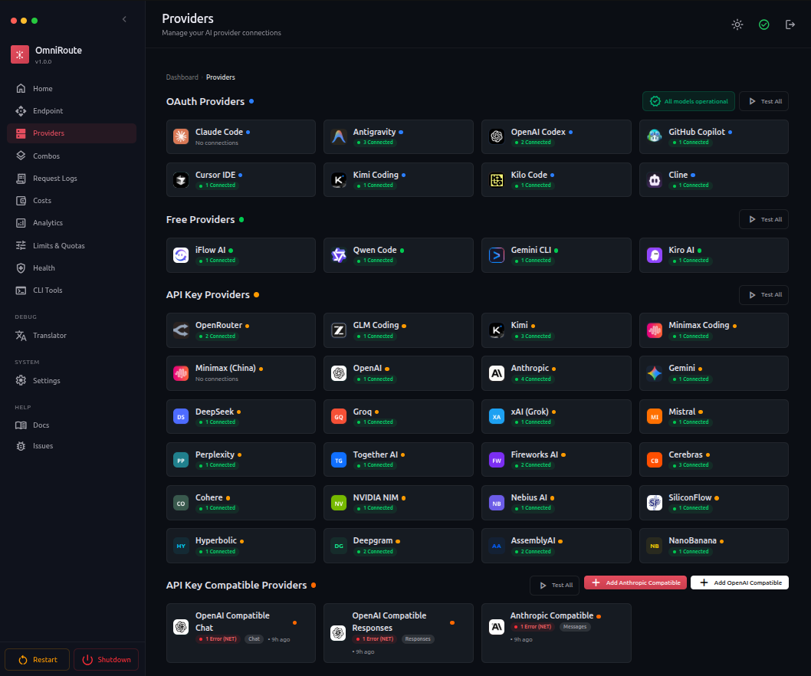
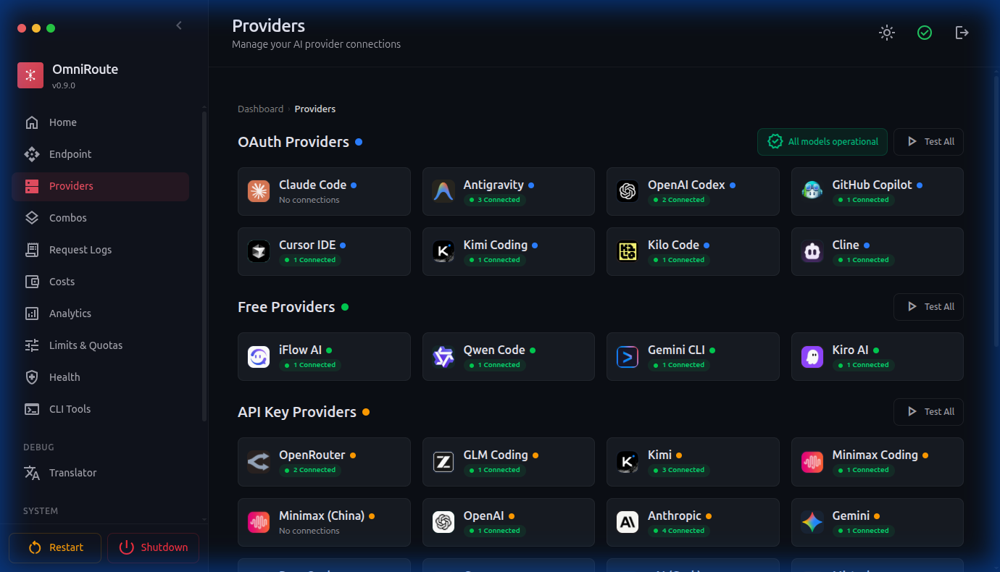
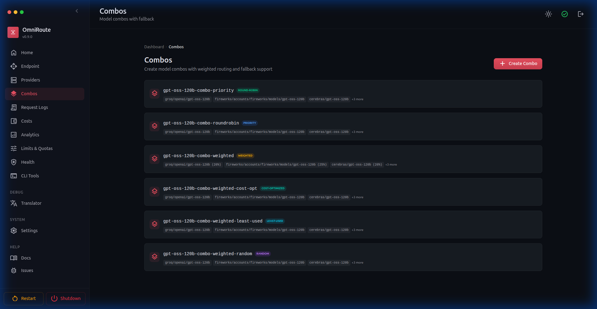
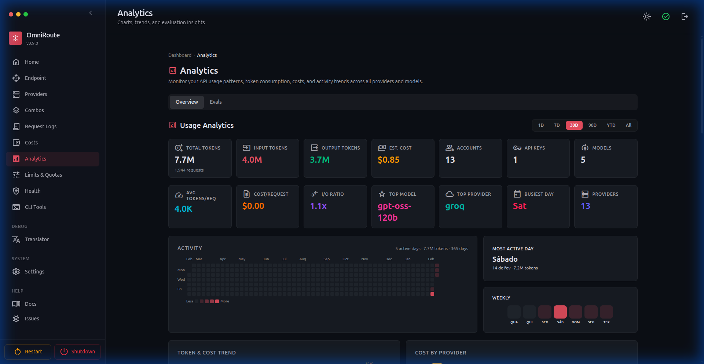
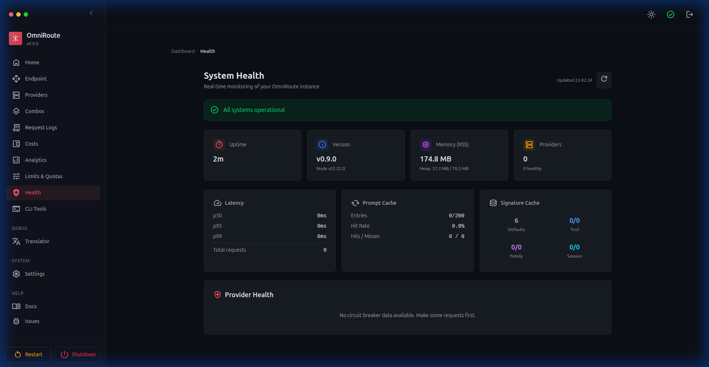
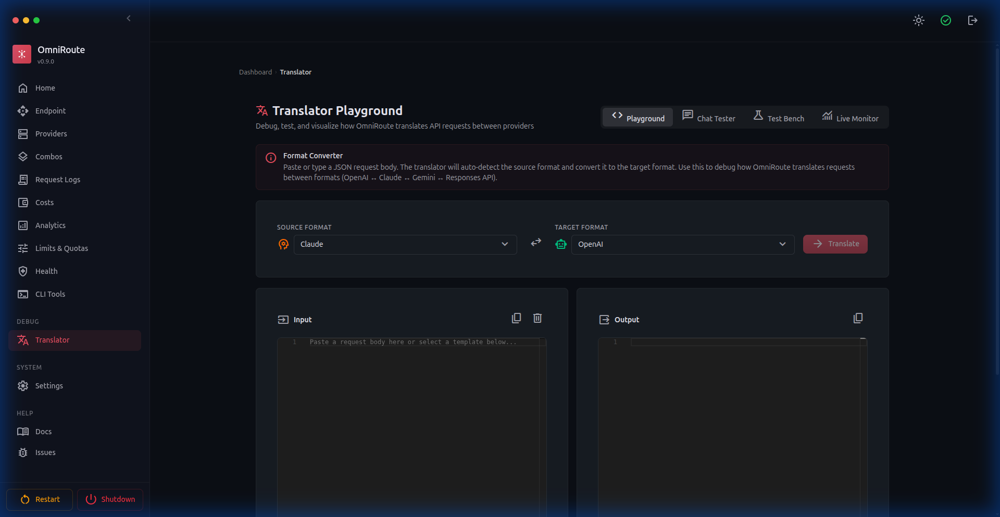
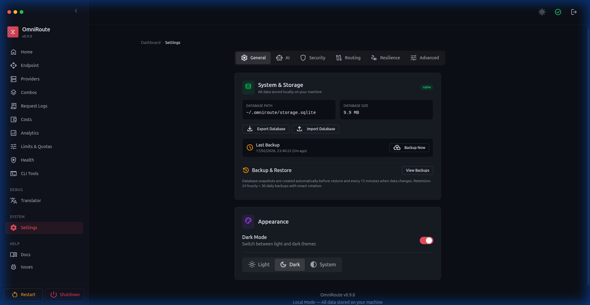
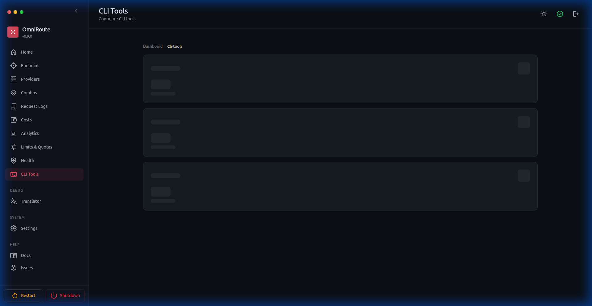
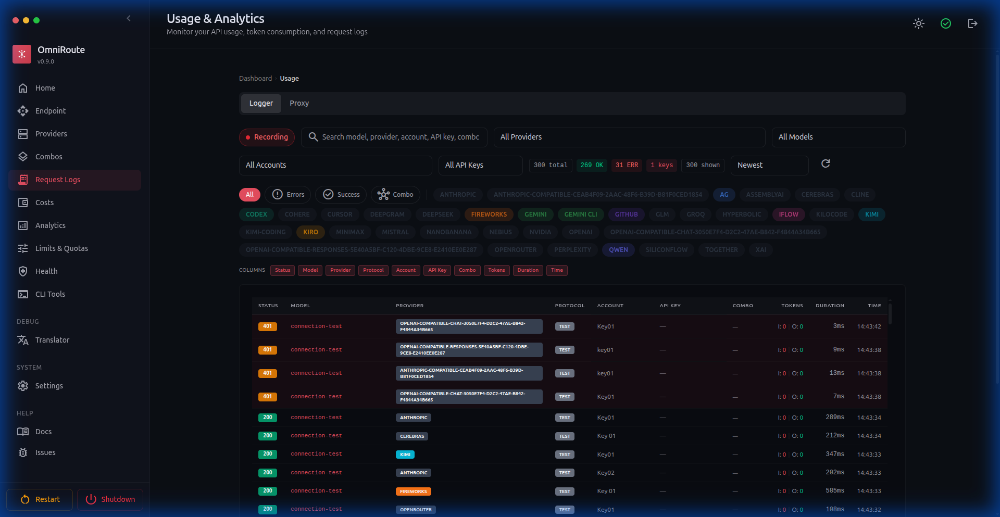

<div align="center">



<br/>

# 🚀 OmniRoute — The Free AI Gateway

### Never stop coding. Connect every AI tool to **177 providers** — **50+ free** — through one endpoint.

**Plug Claude Code, Codex, Cursor, Cline, Copilot & Antigravity into FREE Claude / GPT / Gemini. Auto-fallback.**
<br/>

**RTK + Caveman compression saves 15–95% tokens. Never hit limits.**

<br/>

[](#-177-ai-providers--50-free)
[](#-177-ai-providers--50-free)
[](#%EF%B8%8F-save-1595-tokens--automatically)
[](#-combos--the-flagship)
[](#-quick-start)

<a href="https://trendshift.io/repositories/23589" target="_blank"></a>

[](https://www.npmjs.com/package/omniroute)
[](LICENSE)
[](package.json)
[](https://github.com/diegosouzapw/OmniRoute)

<div align="center">

[](https://www.npmjs.com/package/omniroute)

[](https://hub.docker.com/r/diegosouzapw/omniroute)


[](https://omniroute.online)

</div>

<br/>

[**🚀 Quick Start**](#-quick-start) • [**🎯 Combos**](#-combos--the-flagship) • [**🌐 Providers**](#-177-ai-providers--50-free) • [**🔌 CLI & MCP**](#-full-cli--a2a--mcp) • [**🗜️ Compression**](#%EF%B8%8F-save-1595-tokens--automatically) • [**🌍 Website**](https://omniroute.online) • [**💬 WhatsApp 🌍**](https://chat.whatsapp.com/JI7cDQ1GyaiDHhVBpLxf8b?mode=gi_t) • [**💬 WhatsApp 🇧🇷**](https://chat.whatsapp.com/CeGCxdFzqBe5Uki288wOvf)

[💥 The Promise](#-the-promise) • [🤔 Why](#-why-omniroute) • [🏆 What Sets Apart](#-what-sets-omniroute-apart) • [🤖 Compatible CLIs](#-compatible-clis--coding-agents) • [🖥️ Where It Runs](#%EF%B8%8F-where-omniroute-runs--anywhere) • [🔒 Private](#-private--local-first) • [🎬 In Action](#-omniroute-in-action) • [📚 Explore More](#-explore-more) • [📧 Support](#-support--community)

</div>

<div align="center">
<b>🌐 Available in 40+ languages</b>
<table>
  <tr>
    <td align="center"><a href="README.md">🇺🇸</a></td>
    <td align="center"><a href="docs/i18n/pt-BR/README.md">🇧🇷</a></td>
    <td align="center"><a href="docs/i18n/es/README.md">🇪🇸</a></td>
    <td align="center"><a href="docs/i18n/fr/README.md">🇫🇷</a></td>
    <td align="center"><a href="docs/i18n/it/README.md">🇮🇹</a></td>
    <td align="center"><a href="docs/i18n/ru/README.md">🇷🇺</a></td>
    <td align="center"><a href="docs/i18n/zh-CN/README.md">🇨🇳</a></td>
    <td align="center"><a href="docs/i18n/de/README.md">🇩🇪</a></td>
    <td align="center"><a href="docs/i18n/ja/README.md">🇯🇵</a></td>
    <td align="center"><a href="docs/i18n/ko/README.md">🇰🇷</a></td>
    <td align="center"><a href="docs/i18n/in/README.md">🇮🇳</a></td>
  </tr>
  <tr>
    <td align="center"><a href="docs/i18n/th/README.md">🇹🇭</a></td>
    <td align="center"><a href="docs/i18n/vi/README.md">🇻🇳</a></td>
    <td align="center"><a href="docs/i18n/id/README.md">🇮🇩</a></td>
    <td align="center"><a href="docs/i18n/ms/README.md">🇲🇾</a></td>
    <td align="center"><a href="docs/i18n/phi/README.md">🇵🇭</a></td>
    <td align="center"><a href="docs/i18n/ar/README.md">🇸🇦</a></td>
    <td align="center"><a href="docs/i18n/he/README.md">🇮🇱</a></td>
    <td align="center"><a href="docs/i18n/az/README.md">🇦🇿</a></td>
    <td align="center"><a href="docs/i18n/uk-UA/README.md">🇺🇦</a></td>
    <td align="center"><a href="docs/i18n/pl/README.md">🇵🇱</a></td>
    <td align="center"><a href="docs/i18n/cs/README.md">🇨🇿</a></td>
  </tr>
  <tr>
    <td align="center"><a href="docs/i18n/nl/README.md">🇳🇱</a></td>
    <td align="center"><a href="docs/i18n/bg/README.md">🇧🇬</a></td>
    <td align="center"><a href="docs/i18n/da/README.md">🇩🇰</a></td>
    <td align="center"><a href="docs/i18n/fi/README.md">🇫🇮</a></td>
    <td align="center"><a href="docs/i18n/no/README.md">🇳🇴</a></td>
    <td align="center"><a href="docs/i18n/sv/README.md">🇸🇪</a></td>
    <td align="center"><a href="docs/i18n/hu/README.md">🇭🇺</a></td>
    <td align="center"><a href="docs/i18n/ro/README.md">🇷🇴</a></td>
    <td align="center"><a href="docs/i18n/sk/README.md">🇸🇰</a></td>
    <td align="center"><a href="docs/i18n/pt/README.md">🇵🇹</a></td>
    <td align="center"></td>
  </tr>
</table>
</div>

<br/>

<div align="center">

# 💥 The Promise

</div>

> One endpoint. **177 providers.** Never stop building — and let OmniRoute pick the cheapest one that works.

<table>
  <tr>
    <td width="33%" valign="top"><b>🚫 Never hit limits</b><br/><sub>Auto-fallback across 177 providers in milliseconds. Quota out? Next provider takes over — zero downtime.</sub></td>
    <td width="33%" valign="top"><b>💸 Save up to 95% tokens</b><br/><sub>RTK + Caveman stacked compression cuts 15–95% of eligible tokens (~89% avg on tool-heavy sessions).</sub></td>
    <td width="33%" valign="top"><b>🆓 $0 to start</b><br/><sub>50+ providers with a free tier, 11 free <i>forever</i> (Kiro, Qoder, Pollinations, LongCat…). No card needed.</sub></td>
  </tr>
  <tr>
    <td width="33%" valign="top"><b>🔌 Every tool works</b><br/><sub>16+ coding agents — Claude Code, Codex, Cursor, Cline, Copilot, Antigravity — through one config.</sub></td>
    <td width="33%" valign="top"><b>🧩 One endpoint</b><br/><sub>OpenAI ↔ Claude ↔ Gemini ↔ Responses API translation. Point any tool at <code>/v1</code> and it just works.</sub></td>
    <td width="33%" valign="top"><b>🛡️ Production-grade</b><br/><sub>Circuit breakers, TLS stealth, MCP (37 tools), A2A, memory, guardrails, evals. 4,690+ tests.</sub></td>
  </tr>
</table>

<br/>
<br/>

<div align="center">

# 🤔 Why OmniRoute?

</div>

> Stop juggling 10 dashboards, dead API keys, and surprise bills.

| ❌ The daily pain                                      | ✅ How OmniRoute fixes it                                                     |
| ------------------------------------------------------ | ----------------------------------------------------------------------------- |
| 📉 Subscription quota expires unused every month       | **Maximize subscriptions** — track quota, use every token before reset        |
| 🛑 Rate limits stop you mid-coding                     | **4-tier auto-fallback** — Subscription → API → Cheap → Free, in milliseconds |
| 🔥 Tool outputs (`git diff`, `grep`, logs) burn tokens | **RTK + Caveman compression** — save 15–95% eligible tokens per request       |
| 💸 Expensive APIs ($20–50/mo per provider)             | **Cost-optimized routing** — auto-route to the cheapest viable model          |
| 🧰 Each AI tool wants its own setup                    | **One endpoint, every tool, one dashboard**                                   |
| 🌍 AI blocked in your country                          | **3-level proxy** + TLS fingerprint stealth — use AI from anywhere            |

<div align="center">

```
┌──────────────────────────────────────────────────────────┐
│        Your IDE / CLI  (Claude Code, Cursor, Cline…)       │
└─────────────────────────┬──────────────────────────────────┘
                          │ http://localhost:20128/v1
                          ▼
┌──────────────────────────────────────────────────────────┐
│                  OmniRoute — Smart Router                  │
│  RTK + Caveman compression · 14 routing strategies         │
│  Circuit breakers · TLS stealth · MCP · A2A · Guardrails   │
└─────────────────────────┬──────────────────────────────────┘
        ┌─────────────┬────┴────────┬─────────────┐
        ▼ Tier 1      ▼ Tier 2      ▼ Tier 3       ▼ Tier 4
   SUBSCRIPTION     API KEY        CHEAP          FREE
   Claude Code,     DeepSeek,      GLM $0.5,      Kiro, Qoder,
   Codex, Copilot   Groq, xAI      MiniMax $0.2   Pollinations
   quota out? ───▶  budget hit? ─▶ budget hit? ─▶ always on
```

</div>

<br/>

<div align="center">

# 🎯 Combos — The Flagship

</div>

> A **combo** is a chain of models OmniRoute routes across **automatically**. Quota runs out, a provider fails, or costs spike — the combo silently slides to the next model. **This is what makes OmniRoute unbreakable.** 🛡️

### ⚡ Zero-config — just use `auto`

No combo to create. Set your model to `auto` (or a variant) and OmniRoute builds a virtual combo from your connected providers, scored live:

| Model ID       | What it optimizes for                                          |
| -------------- | -------------------------------------------------------------- |
| `auto`         | 🎯 Balanced default (LKGP — sticks to your last good provider) |
| `auto/coding`  | 🧑‍💻 Quality-first weights for code generation                   |
| `auto/fast`    | ⚡ Lowest latency first                                        |
| `auto/cheap`   | 💰 Cheapest per token first                                    |
| `auto/offline` | 🔋 Most quota / rate-limit headroom first                      |
| `auto/smart`   | 🔭 Quality-first + 10% exploration to discover better models   |

##

### 🔀 Or build your own — 14 routing strategies

| Goal                                    | Strategy / combo                                   |
| --------------------------------------- | -------------------------------------------------- |
| 🥇 Drain my subscription before paying  | `priority` / `fill-first`                          |
| ⚖️ Spread load across accounts          | `round-robin` · `weighted` · `p2c` · `least-used`  |
| 💸 Always cheapest viable model         | `cost-optimized` · `auto/cheap`                    |
| 🧠 Hand off long context between models | `context-relay` · `context-optimized`              |
| 🎲 Randomized / privacy routing         | `random` · `strict-random`                         |
| 🤖 Just make it smart                   | `auto` (9-factor scoring) · `lkgp` · `reset-aware` |

<sub>The Auto-Combo engine scores every candidate on **9 factors** (health, quota, cost, latency, success rate, freshness…) — see [`docs/routing/AUTO-COMBO.md`](docs/routing/AUTO-COMBO.md).</sub>

##

### 🧱 Resilience is built in (3 independent layers)

| Layer                      | Scope             | What it does                                                               |
| -------------------------- | ----------------- | -------------------------------------------------------------------------- |
| 🔌 **Circuit breaker**     | whole provider    | Stops hammering a provider that's failing upstream; auto-probes to recover |
| 💤 **Connection cooldown** | one account / key | Skips a rate-limited key while other keys keep serving                     |
| 🎯 **Model lockout**       | provider + model  | Quarantines just one quota-limited model, not the whole connection         |

```
Combo: "always-on"                         Strategy: priority
  1. cc/claude-opus-4-7   ← subscription (use it fully)
  2. cx/gpt-5.5           ← second subscription
  3. glm/glm-5.1          ← cheap backup ($0.5/1M)
  4. kr/claude-sonnet-4.5 ← FREE, unlimited (never fails)
Result: 4 layers of fallback = zero downtime
```

<sub>📖 [Auto-Combo Engine](docs/routing/AUTO-COMBO.md) · [Resilience Guide](docs/architecture/RESILIENCE_GUIDE.md)</sub>

<br/>

<div align="center">

# 🏆 What Sets OmniRoute Apart

</div>

| Feature                                | OmniRoute                                                   | Other routers |
| -------------------------------------- | ----------------------------------------------------------- | ------------- |
| 🌐 Providers                           | **177**                                                     | 20–100        |
| 🆓 Free providers                      | **50+ (11 free forever)**                                   | 1–5           |
| 🔀 Routing strategies                  | **14** (priority, weighted, cost-optimized, context-relay…) | 1–3           |
| 🗜️ Token compression                   | **RTK + Caveman stacked (15–95%)**                          | None / 20–40% |
| 🧰 Built-in MCP server                 | **37 tools, 3 transports, 13 scopes**                       | Rare          |
| 🤝 A2A agent protocol                  | **5 skills, JSON-RPC 2.0**                                  | None          |
| 🧠 Memory (FTS5 + vector)              | **Yes**                                                     | Rare          |
| 🛡️ Guardrails (PII, injection, vision) | **Yes**                                                     | Rare          |
| ☁️ Cloud agents                        | **Codex, Devin, Jules**                                     | None          |
| 🥷 TLS fingerprint stealth             | **JA3/JA4 via wreq-js**                                     | None          |
| 🖥️ Multi-platform                      | **Web · Desktop · Termux · PWA**                            | Web only      |
| 🌍 i18n                                | **40+ locales**                                             | 0–4           |

<sub>📊 Detailed comparison vs LiteLLM, OpenRouter & Portkey → [`docs/comparison/OMNIROUTE_VS_ALTERNATIVES.md`](docs/comparison/OMNIROUTE_VS_ALTERNATIVES.md)</sub>

<br/>

<div align="center">

# 🤖 Compatible CLIs & Coding Agents

> One config — `http://localhost:20128/v1` — and **every** AI IDE or CLI runs on free & low-cost models.

<div align="center">
<table>
  <tr>
    <td align="center" width="120"><a href="https://github.com/anthropics/claude-code"><br/><b>Claude Code</b></a></td>
    <td align="center" width="120"><a href="https://github.com/openai/codex"><br/><b>Codex CLI</b></a></td>
    <td align="center" width="120"><a href="https://github.com/google-gemini/gemini-cli"><br/><b>Gemini CLI</b></a></td>
    <td align="center" width="120"><br/><b>Cursor</b></td>
    <td align="center" width="120"><br/><b>Copilot</b></td>
    <td align="center" width="120"><br/><b>Continue</b></td>
  </tr>
  <tr>
    <td align="center" width="120"><a href="https://github.com/anomalyco/opencode"><br/><b>OpenCode</b></a></td>
    <td align="center" width="120"><a href="https://github.com/Kilo-Org/kilocode"><br/><b>Kilo Code</b></a></td>
    <td align="center" width="120"><br/><b>Droid</b></td>
    <td align="center" width="120"><br/><b>OpenClaw</b></td>
    <td align="center" width="120"><br/><b>Kiro</b></td>
    <td align="center" width="120"><br/><b>Command</b></td>
  </tr>
</table>
</div>

<div align="center">
<b>＋ also works with</b> · Cline · Antigravity · Windsurf · AMP · Hermes · Qwen CLI · Roo · Continue · <b>any OpenAI-compatible tool</b>
</div>

<sub>📖 Per-tool setup for all 16+ tools → [`docs/reference/CLI-TOOLS.md`](docs/reference/CLI-TOOLS.md) · 🧩 OpenCode plugin → [`@omniroute/opencode-provider`](https://www.npmjs.com/package/@omniroute/opencode-provider)</sub>

</div>

<br/>

<div align="center">

# 🌐 177 AI Providers — 50+ Free

</div>

> The most complete catalog of any open-source router: **177 providers**, **50+ with a free tier**, **11 free forever**.

<div align="center">

### 🆓 Free Forever — $0, no card

<table>
  <tr>
    <td align="center" width="150"><br/><sub>GPT-5, Claude, Gemini<br/>$100 free credits</sub></td>
    <td align="center" width="150"><br/><sub>Kimi-K2, DeepSeek-R1<br/>Unlimited FREE</sub></td>
    <td align="center" width="150"><br/><sub>GPT-5, Claude, Llama 4<br/>No key needed</sub></td>
    <td align="center" width="150"><br/><sub>Flash-Lite<br/>50M tokens/day 🔥</sub></td>
  </tr>
  <tr>
    <td align="center" width="150"><br/><sub>50+ models<br/>10K neurons/day</sub></td>
    <td align="center" width="150"><br/><sub>gemini-3-flash<br/>180K/mo free</sub></td>
    <td align="center" width="150"><br/><sub>129 models<br/>~40 RPM free</sub></td>
    <td align="center" width="150"><br/><sub>Qwen3 235B<br/>1M tokens/day</sub></td>
  </tr>
</table>

📖 Full machine-readable catalog → [`docs/reference/PROVIDER_REFERENCE.md`](docs/reference/PROVIDER_REFERENCE.md)

<br/>
</div>

<div align="center">

# 🖥️ Where OmniRoute Runs — Anywhere

</div>

> Same app, your machine, your rules. From a global npm install to **your phone** via Termux.

| Platform                  | Install                                      | Highlights                                                |
| ------------------------- | -------------------------------------------- | --------------------------------------------------------- |
| 📦 **npm (global)**       | `npm install -g omniroute`                   | One command, any OS                                       |
| 🐳 **Docker**             | `docker run … diegosouzapw/omniroute`        | Multi-arch **AMD64 + ARM64**                              |
| 🖥️ **Desktop (Electron)** | `npm run electron:build`                     | Native window + system tray — **Windows / macOS / Linux** |
| 💪 **ARM**                | native `arm64`                               | Raspberry Pi, ARM servers, Apple Silicon                  |
| 📱 **Android (Termux)**   | `pkg install nodejs-lts && npx -y omniroute` | Runs **on your phone**, 24/7, no root                     |
| 📲 **PWA**                | "Add to Home Screen"                         | Fullscreen, offline, installable from browser             |
| 🧩 **OpenCode plugin**    | `@omniroute/opencode-provider`               | Native OpenCode integration                               |
| 🛠️ **From source**        | `npm install && npm run dev`                 | Hack on it, contribute                                    |

<sub>📖 [Docker Guide](docs/guides/DOCKER_GUIDE.md) · [Desktop](electron/README.md) · [Termux](docs/guides/TERMUX_GUIDE.md) · [PWA](docs/guides/PWA_GUIDE.md) · [OpenCode](docs/frameworks/OPENCODE.md)</sub>

<br/>

<div align="center">

# 🔒 Private & Local-First

</div>

> Your keys, your machine, your data. OmniRoute is a **local proxy** — it never phones home.

- 🏠 **Runs 100% on your hardware** — npm, Docker, desktop, or your phone. No OmniRoute cloud sits in the request path.
- 🔐 **Credentials encrypted at rest** — API keys & OAuth tokens sealed with **AES-256-GCM**.
- 🚫 **Zero telemetry by default** — your prompts go only to the providers _you_ choose, nowhere else.
- 🛡️ **Hardened gateway** — API-key scoping, IP filtering, rate limits, prompt-injection guard, loopback-only process routes.
- 📜 **MIT licensed & fully open-source** — audit every line, self-host forever.

<sub>📖 [Authorization](docs/architecture/AUTHZ_GUIDE.md) · [Guardrails](docs/security/GUARDRAILS.md) · [Compliance](docs/security/COMPLIANCE.md)</sub>

<br/>

<div align="center">

# 🔌 Full CLI + A2A & MCP

</div>

> OmniRoute isn't just a server — it's a **full command-line cockpit** with **60+ commands**, plus open agent protocols so an AI agent can drive OmniRoute **by itself**.

### ⌨️ A real CLI (not just `start`)

```bash
omniroute               # serve gateway + dashboard (port 20128)
omniroute chat          # interactive TUI chat client (slash: /model /combo /skill /memory)
omniroute setup         # guided first-run wizard
omniroute doctor        # diagnose providers, ports, native deps
```

<div align="center">

`providers` · `oauth` · `keys` · `combo` · `nodes` · `models` · `cache` · `compression` · `cost` · `usage` · `quota` · `health` · `resilience` · `telemetry` · `logs` · `audit` · `mcp` · `a2a` · `cloud` · `memory` · `skills` · `eval` · `tunnel` · `backup` · `sync` · `webhooks` · `policy` · `pricing` · `translator` · `simulate` …

</div>

### 🤝 Connect an agent — and it controls OmniRoute itself

Expose OmniRoute over **MCP** or **A2A** and any capable agent gets the keys to the whole gateway — routing, providers, combos, cache, compression, memory — autonomously.

| Protocol           | Endpoint                                        | Use it for                                             |
| ------------------ | ----------------------------------------------- | ------------------------------------------------------ |
| 🧰 **MCP (stdio)** | `omniroute --mcp`                               | Plug into Claude Desktop, Cursor, any MCP client       |
| 🌊 **MCP (HTTP)**  | `http://localhost:20128/api/mcp/stream`         | Remote MCP — **37 tools**, 13 scopes, full audit trail |
| 📡 **MCP (SSE)**   | `http://localhost:20128/api/mcp/sse`            | Streaming MCP transport                                |
| 🤝 **A2A**         | `http://localhost:20128/.well-known/agent.json` | Agent-to-agent, **JSON-RPC 2.0** + SSE, 5 skills       |

```bash
# Give Claude Code the full OmniRoute toolset over MCP:
claude mcp add-server omniroute --type http --url http://localhost:20128/api/mcp/stream
```

<sub>📖 [MCP Server](docs/frameworks/MCP-SERVER.md) · [A2A Server](docs/frameworks/A2A-SERVER.md) · [Agent Protocols](docs/frameworks/AGENT_PROTOCOLS_GUIDE.md)</sub>

<br/>

<div align="center">

# 🗜️ Save 15–95% Tokens — Automatically

</div>

> **Why use many token when few token do trick?** Every request passes through OmniRoute's compression pipeline **transparently** — no client changes. It stacks ideas from [RTK](https://github.com/rtk-ai/rtk), [Caveman](https://github.com/JuliusBrussee/caveman) (⭐ 51K+), and [Troglodita](https://github.com/leninejunior/troglodita) (PT-BR).

| Mode                           | Savings    | Best for                    |
| ------------------------------ | ---------- | --------------------------- |
| 🪶 **Lite**                    | ~15%       | Always-on safe default      |
| 🪨 **Standard (Caveman)**      | ~30%       | Daily coding                |
| ⚡ **Aggressive**              | ~50%       | Long tool-heavy sessions    |
| 🔥 **Ultra**                   | ~75%       | Maximum savings             |
| 🧰 **RTK**                     | 60–90%     | Shell/test/build/git output |
| 🔗 **Stacked (RTK → Caveman)** | **78–95%** | Mixed prompts + tool logs   |

**Real example — Standard mode:**

> **Before (69 tokens):** _"The reason your React component is re-rendering is likely because you're creating a new object reference on each render cycle. When you pass an inline object as a prop, React's shallow comparison sees it as a different object every time, which triggers a re-render. I would recommend using useMemo to memoize the object."_
>
> **After (19 tokens):** _"New object ref each render. Inline object prop = new ref = re-render. Wrap in useMemo."_
>
> **Same answer. 72% fewer tokens. Zero accuracy loss.** ✅

**PT-BR example — [Troglodita](https://github.com/leninejunior/troglodita) mode:**

> **Antes (42 tokens):** _"O problema é que o componente está re-renderizando porque uma nova referência de objeto está sendo criada em cada ciclo de renderização. Eu recomendaria usar useMemo."_
>
> **Depois (12 tokens):** _"Re-render: ref nova cada ciclo (objeto inline recriado). Usar `useMemo`."_
>
> **Mesma resposta. ~70% menos tokens. Precisão técnica intacta.** ✅

<br/>

### 📖 How it works — pipeline, architecture & savings math</b></summary>

```
Client (10,000 tok) ──▶ OmniRoute Compression (7 options) ──▶ Provider (~1,080 tok, up to 95% saved)
```

Default stacked combo runs `RTK → Caveman`. When both act on the same tool/context payload, savings compound:

```txt
combined = 1 − (1 − RTK) × (1 − Caveman_input)
average  = 1 − (1 − 0.80) × (1 − 0.46) = 89.2%
range    = 78.4 – 94.6%
```

Code blocks, URLs, JSON and structured data are **always protected** by the preservation engine. Auto-trigger compression by token threshold, or assign a compression pipeline per routing combo.

📖 [`COMPRESSION_GUIDE.md`](docs/compression/COMPRESSION_GUIDE.md) · [`RTK_COMPRESSION.md`](docs/compression/RTK_COMPRESSION.md) · [`COMPRESSION_ENGINES.md`](docs/compression/COMPRESSION_ENGINES.md)

<br/>

<div align="center">

# ⚡ Quick Start

</div>

**1) Install & run**

```bash
npm install -g omniroute
omniroute
```

Dashboard at `http://localhost:20128` · API at `http://localhost:20128/v1`.

**2) Connect a FREE provider (no signup)**

Dashboard → **Providers** → connect **Kiro AI** (free Claude unlimited) or **OpenCode Free** (no auth) → done.

**3) Point your coding tool**

```txt
Base URL: http://localhost:20128/v1
API Key:  [copy from Dashboard → Endpoints]
Model:    auto            (zero-config smart routing — or any provider/model)
```

**4) Verify it's working**

```bash
curl http://localhost:20128/v1/models -H "Authorization: Bearer YOUR_KEY"
```

You should see your connected models listed. 🎉 That's it — start coding, and OmniRoute auto-routes & falls back for you.

<br/>

## 📦 More install methods — Docker, source, pnpm, Arch</b></summary>

**🐳 Docker**

```bash
docker run -d --name omniroute --restart unless-stopped --stop-timeout 40 \
  -p 20128:20128 -v omniroute-data:/app/data diegosouzapw/omniroute:latest
```

**🛠️ From source**

```bash
cp .env.example .env && npm install
PORT=20128 npm run dev
```

**📦 pnpm**

```bash
pnpm install -g omniroute && pnpm approve-builds -g && omniroute
```

**🐧 Arch Linux (AUR)**

```bash
yay -S omniroute-bin && systemctl --user enable --now omniroute.service
```

**🔧 Nix (Flake)**

```bash
# Using Nix flakes
nix develop
npm run dev

# Or using devbox
devbox run npm run dev
```

📖 [Docker Guide](docs/guides/DOCKER_GUIDE.md) — Compose profiles, Caddy HTTPS, Cloudflare tunnels.

</details>

<br/>

<div align="center">

# 🎬 OmniRoute in Action

</div>

<div align="center">
<table>
  <tr>
    <td align="center" width="280">
      <a href="https://www.youtube.com/watch?v=Rxdc36yUyOQ"></a><br/>
      <b>🇧🇷 Português</b><br/><sub>Guia completo</sub>
    </td>
    <td align="center" width="280">
      <a href="https://www.youtube.com/watch?v=CMzyOiUyEVc"></a><br/>
      <b>🇺🇸 English</b><br/><sub>Complete walkthrough</sub>
    </td>
    <td align="center" width="280">
      <a href="https://www.youtube.com/watch?v=il_5Ii6v4-Y"></a><br/>
      <b>🇷🇺 Русский</b><br/><sub>Полное руководство</sub>
    </td>
  </tr>
</table>
</div>

<div align="center">

> 🎬 **Made a video about OmniRoute?** Open an [issue](https://github.com/diegosouzapw/OmniRoute/issues/new) or [discussion](https://github.com/diegosouzapw/OmniRoute/discussions) with the link — we'll feature it here.

<br/>
</div>

<div align="center">

# 📚 Explore More

</div>

<details>
<summary><b>💰 Pricing at a glance & the $0 Free Stack (11 providers)</b></summary>

<br/>

| Tier                        | Example                                  | Cost       |
| --------------------------- | ---------------------------------------- | ---------- |
| 💳 **Subscription**         | Claude Code Pro / Codex / Copilot        | $10–200/mo |
| 🔑 **API Key (free tiers)** | NVIDIA NIM, Cerebras, Groq               | **FREE**   |
| 💰 **Cheap**                | GLM-5 $0.5/1M · MiniMax M2.5 $0.3/1M     | pennies    |
| 🆓 **Free Forever**         | Kiro, Qoder, Qwen, Pollinations, LongCat | **$0**     |

**The $0 Free Stack — combine into one unbreakable combo:**

| Provider          | Prefix      | Free models                                     | Quota             |
| ----------------- | ----------- | ----------------------------------------------- | ----------------- |
| **Kiro**          | `kr/`       | Claude Sonnet 4.5, Haiku 4.5, Opus 4.6          | 50 credits/mo     |
| **Qoder**         | `if/`       | kimi-k2-thinking, qwen3-coder-plus, deepseek-r1 | ♾️ Unlimited      |
| **Qwen**          | `qw/`       | qwen3-coder-plus/flash/next                     | ♾️ Unlimited      |
| **Pollinations**  | `pol/`      | GPT-5, Claude, Gemini, DeepSeek, Llama 4        | No key needed     |
| **LongCat**       | `lc/`       | LongCat-Flash-Lite                              | 50M tokens/day 🔥 |
| **Cloudflare AI** | `cf/`       | 50+ models                                      | 10K neurons/day   |
| **NVIDIA NIM**    | `nvidia/`   | 129 models                                      | ~40 RPM           |
| **Cerebras**      | `cerebras/` | Qwen3 235B, GPT-OSS 120B                        | 1M tok/day        |

> 💡 The dashboard "cost" is a **savings tracker**, not a bill — OmniRoute never charges you. A "$290 total cost" using free models means **$290 saved**.

📖 Complete free directory → [`docs/reference/FREE_TIERS.md`](docs/reference/FREE_TIERS.md) — 25+ providers, quotas, base URLs.

</details>

<details>
<summary><b>🎯 Use Cases — ready-made combo playbooks</b></summary>

<br/>

**$0 forever:**

```
1. kr/claude-sonnet-4.5   (Kiro — unlimited)
2. if/kimi-k2-thinking    (Qoder — unlimited)
3. pol/gpt-5              (Pollinations — no key)
4. lc/longcat-flash-lite  (50M tok/day backup)
Compression: aggressive (~50%) → double your free quota · Cost: $0/mo
```

**24/7 no interruptions:** chain 2 subscriptions → cheap → free for 5 layers of fallback.
**Blocked region:** free providers + global/per-provider proxy → access AI from any country.
**Max savings:** subscription + cheap backup + `ultra` compression (~75%) → ~$150–300/mo saved for heavy users.

</details>

<details>
<summary><b>🌍 Bypass geo-blocks — 3-level proxy + stealth</b></summary>

<br/>

🇷🇺 🇨🇳 🇮🇷 🇨🇺 🇹🇷 In a blocked region? OmniRoute's **3-level proxy** (Global / Per-Provider / Per-Connection) proxies API requests, OAuth flows, connection tests, token refresh & model sync.

- **Protocols:** HTTP/HTTPS, SOCKS5, authenticated proxies
- **🆓 1proxy marketplace** — hundreds of free validated proxies, quality scores, auto-rotation
- **Anti-detection** — TLS fingerprint spoofing (`wreq-js`), CLI fingerprint matching, proxy IP preservation

📖 [`docs/ops/PROXY_GUIDE.md`](docs/ops/PROXY_GUIDE.md)

</details>

<details>
<summary><b>✨ Full feature list — 30+ capabilities (memory, evals, observability)</b></summary>

<br/>

**Routing:** 14 strategies · task-aware smart routing · thinking budget controls · wildcard routing · system prompt injection.
**Compatibility:** OpenAI ↔ Claude ↔ Gemini ↔ Responses API · auto OAuth refresh (PKCE, 8 providers) · multi-account round-robin · Batch + Files API · live OpenAPI 3.0.
**Protocols:** MCP (37 tools, 3 transports, 13 scopes) · A2A (JSON-RPC 2.0, SSE, skills) · ACP · cloud agents (Codex, Devin, Jules).
**Quality & Ops:** built-in **Evals** (golden-set: exact/contains/regex/custom) · guardrails (PII, injection, vision) · health dashboard · p50/p95/p99 telemetry · webhooks · compliance audit.
**AI Agent Skills:** drop-in markdown manifests — point any agent at `skills/omniroute/SKILL.md`. 10 skills available.

📖 [MCP Server](open-sse/mcp-server/README.md) · [A2A Server](src/lib/a2a/README.md) · [Resilience Guide](docs/architecture/RESILIENCE_GUIDE.md) · [Features Gallery](docs/guides/FEATURES.md)

</details>

<details>
<summary><b>📖 Setup, env vars & FAQ</b></summary>

<br/>

| Env var           | Default        | Purpose                          |
| ----------------- | -------------- | -------------------------------- |
| `PORT`            | `20128`        | API + dashboard port             |
| `REQUIRE_API_KEY` | `false`        | Require API key for all requests |
| `DATA_DIR`        | `~/.omniroute` | Database & config storage        |

**Will I be charged by OmniRoute?** No — it's free, open-source software on your machine. You only pay paid providers directly. OmniRoute has no billing system.
**Are FREE providers really unlimited?** Yes — Kiro, Qoder, Pollinations, LongCat, Cloudflare. No catch.
**Will compression hurt quality?** No — it only compresses the **input**; code, URLs, JSON are always protected.
**Does it work where AI is blocked?** Yes — 3-level proxy + 1proxy marketplace reach all 177 providers.

📖 [User Guide](docs/guides/USER_GUIDE.md) · [API Reference](docs/reference/API_REFERENCE.md) · [Environment Config](docs/reference/ENVIRONMENT.md)

</details>

<details>
<summary><b>🐛 Troubleshooting</b></summary>

<br/>

| Problem                                   | Quick fix                                                     |
| ----------------------------------------- | ------------------------------------------------------------- |
| "Language model did not provide messages" | Provider quota exhausted → use a combo fallback               |
| Rate limiting (429)                       | Add fallback: `cc/claude → glm/glm-4.7 → if/kimi-k2-thinking` |
| OAuth token expired                       | Auto-refreshed; if stuck, delete + re-auth in Providers       |
| `unsupported_country_region_territory`    | Configure proxy in Settings → Proxy                           |
| Docker SQLite locks                       | Use `--stop-timeout 40` for clean WAL checkpoint              |
| Node runtime errors                       | Use Node `>=20.20.2 <21`, `>=22.22.2 <23`, or `>=24 <25`      |

🐛 **Reporting a bug?** Run `npm run system-info` and attach `system-info.txt`. 📖 [`docs/guides/TROUBLESHOOTING.md`](docs/guides/TROUBLESHOOTING.md)

</details>

<details>
<summary><b>📸 Dashboard screenshots</b></summary>

<br/>

| Page       | Screenshot                                        | Page       | Screenshot                                    |
| ---------- | ------------------------------------------------- | ---------- | --------------------------------------------- |
| Providers  |    | Combos     |      |
| Analytics  |    | Health     |      |
| Translator |  | Settings   |  |
| CLI Tools  |    | Usage Logs |        |

</details>

<br/>

<div align="center">

# 📧 Support & Community

> 💬 **Join our WhatsApp groups** — get help, share tips, stay updated:
> · [**🌍 International**](https://chat.whatsapp.com/JI7cDQ1GyaiDHhVBpLxf8b?mode=gi_t) · [**🇧🇷 Português**](https://chat.whatsapp.com/CeGCxdFzqBe5Uki288wOvf)

- 🌍 **Website**: [omniroute.online](https://omniroute.online)
- 🐙 **GitHub**: [github.com/diegosouzapw/OmniRoute](https://github.com/diegosouzapw/OmniRoute)
- 🐛 **Issues**: [report a bug](https://github.com/diegosouzapw/OmniRoute/issues) (attach `npm run system-info` output)
- 🤝 **Contributing**: see [CONTRIBUTING.md](CONTRIBUTING.md) or pick a `good first issue`

</div>

---

<br/>
<div align="center">

## 🛠️ Tech Stack

</div>

- **Runtime**: Node.js 20.20.2+, 22.22.2+, or 24.x LTS (24 LTS recommended)
- **Language**: TypeScript 5.9 — **100% TypeScript** across `src/` and `open-sse/` (zero `any` in core modules since v2.0)
- **Framework**: Next.js 16 + React 19 + Tailwind CSS 4
- **Database**: better-sqlite3 (SQLite) + LowDB (JSON legacy) — domain state, proxy logs, MCP audit, routing decisions, memory, skills
- **Schemas**: Zod (MCP tool I/O validation, API contracts)
- **Protocols**: MCP (stdio/HTTP) + A2A v0.3 (JSON-RPC 2.0 + SSE)
- **Streaming**: Server-Sent Events (SSE) + WebSocket bridge (`/v1/ws`)
- **Auth**: OAuth 2.0 (PKCE) + JWT + API Keys + MCP Scoped Authorization
- **Testing**: Node.js test runner + Vitest (**4,690+ test cases** across 517 files — unit, integration, E2E, security, ecosystem)
- **Platforms**: Desktop (Electron), Android (Termux), PWA (any browser)
- **CI/CD**: GitHub Actions (auto npm publish + Docker Hub on release)
- **Website**: [omniroute.online](https://omniroute.online)
- **Package**: [npmjs.com/package/omniroute](https://www.npmjs.com/package/omniroute)
- **Docker**: [hub.docker.com/r/diegosouzapw/omniroute](https://hub.docker.com/r/diegosouzapw/omniroute)
- **Resilience**: Circuit breaker, exponential backoff, anti-thundering herd, TLS spoofing, auto-combo self-healing

<div align="center">

<br/>

## 📖 Documentation

</div>

### 📘 Getting Started

| Document                              | Description                                                                   |
| ------------------------------------- | ----------------------------------------------------------------------------- |
| [User Guide](docs/guides/USER_GUIDE.md)      | Providers, combos, CLI integration, deployment                                |
| [Setup Guide](docs/guides/SETUP_GUIDE.md)    | Full install methods, CLI tool configs, protocol setup, timeout tuning        |
| [CLI Tools Guide](docs/reference/CLI-TOOLS.md) | Per-tool setup for Claude Code, Codex, Cursor, Cline, OpenClaw, Kilo, Copilot |
| [Quick Start](README.md#-quick-start) | 3-step install → connect → configure                                          |

### 🔧 Operations & Deployment

| Document                                             | Description                                                    |
| ---------------------------------------------------- | -------------------------------------------------------------- |
| [Docker Guide](docs/guides/DOCKER_GUIDE.md)                 | Docker run, Compose profiles, Caddy HTTPS, tunnels, image tags |
| [VM Deployment](docs/ops/VM_DEPLOYMENT_GUIDE.md)         | Complete guide: VM + nginx + Cloudflare setup                  |
| [Fly.io Deployment](docs/ops/FLY_IO_DEPLOYMENT_GUIDE.md) | Deploy to Fly.io with persistent storage                       |
| [Termux Guide](docs/guides/TERMUX_GUIDE.md)                 | Run OmniRoute on Android via Termux                            |
| [PWA Guide](docs/guides/PWA_GUIDE.md)                       | Progressive Web App install, caching, architecture             |
| [Uninstall Guide](docs/guides/UNINSTALL.md)                 | Clean removal for all install methods                          |
| [Environment Config](docs/reference/ENVIRONMENT.md)            | Complete `.env` variables and references                       |

### 🧠 Features & Architecture

| Document                                                         | Description                                                                   |
| ---------------------------------------------------------------- | ----------------------------------------------------------------------------- |
| [Architecture](docs/architecture/ARCHITECTURE.md)                          | System architecture, data flow, and internals                                 |
| [Compression Guide](docs/compression/COMPRESSION_GUIDE.md)                | 7-option pipeline: off / lite / standard / aggressive / ultra / RTK / stacked |
| [RTK Compression](docs/compression/RTK_COMPRESSION.md)                    | Command-output compression, filters, trust, verify, raw-output recovery       |
| [Compression Engines](docs/compression/COMPRESSION_ENGINES.md)            | Caveman, RTK, stacked pipelines, dashboard/API/MCP surfaces                   |
| [Compression Rules Format](docs/compression/COMPRESSION_RULES_FORMAT.md)  | JSON rule-pack schemas for Caveman and RTK filters                            |
| [Compression Language Packs](docs/compression/COMPRESSION_LANGUAGE_PACKS.md) | Language detection and Caveman rule-pack authoring                         |
| [Resilience Guide](docs/architecture/RESILIENCE_GUIDE.md)                 | Circuit breakers, cooldowns, queue, anti-thundering herd, TLS spoofing        |
| [Auto-Combo Engine](docs/routing/AUTO-COMBO.md)                           | 6-factor scoring, mode packs, self-healing                                    |
| [Proxy Guide](docs/ops/PROXY_GUIDE.md)                                    | 3-level proxy system, 1proxy marketplace, registry CRUD                       |
| [Free Tiers](docs/reference/FREE_TIERS.md)                                | 25+ free API providers consolidated directory                                 |
| [Features Gallery](docs/guides/FEATURES.md)                               | Visual dashboard tour with screenshots                                        |
| [Codebase Documentation](docs/architecture/CODEBASE_DOCUMENTATION.md)      | Beginner-friendly codebase walkthrough                                        |

### 🤖 Protocols & APIs

| Document                                    | Description                                         |
| ------------------------------------------- | --------------------------------------------------- |
| [API Reference](docs/reference/API_REFERENCE.md)         | All endpoints with examples                         |
| [OpenAPI Spec](docs/reference/openapi.yaml)               | OpenAPI 3.0 specification                           |
| [MCP Server](open-sse/mcp-server/README.md) | 29 MCP tools, IDE configs, Python/TS/Go clients     |
| [MCP Server Guide](docs/frameworks/MCP-SERVER.md)         | MCP installation, transports, and tool reference    |
| [A2A Server](src/lib/a2a/README.md)         | JSON-RPC 2.0 protocol, skills, streaming, task mgmt |
| [A2A Server Guide](docs/frameworks/A2A-SERVER.md)         | A2A agent card, tasks, skills, and streaming        |

### 📋 Project & Quality

| Document                                       | Description                                     |
| ---------------------------------------------- | ----------------------------------------------- |
| [Contributing](CONTRIBUTING.md)                | Development setup and guidelines                |
| [Security Policy](SECURITY.md)                 | Vulnerability reporting and security practices  |
| [i18n Guide](docs/guides/I18N.md)                     | 40+ language support, translation workflow, RTL |
| [Release Checklist](docs/ops/RELEASE_CHECKLIST.md) | Pre-release validation steps                    |
| [Coverage Plan](docs/ops/COVERAGE_PLAN.md)         | Test coverage strategy and 4,690+ test suite    |

<br/>

<div align="center">

# ⭐ Top Contributors

> OmniRoute is shaped by a passionate open-source community. These individuals have made exceptional contributions that directly impact the quality, stability, and reach of the project. **Thank you.**

<table>
  <tr>
    <td align="center" width="160">
      <a href="https://github.com/oyi77">
        <br/>
        <b>oyi77</b>
      </a><br/>
      <sub>🥇 190 commits • +72K lines</sub><br/>
      <sub>Analytics engine, SQL aggregations,<br/>proxy marketplace, test coverage</sub>
    </td>
    <td align="center" width="160">
      <a href="https://github.com/christopher-s">
        <br/>
        <b>Chris Staley</b>
      </a><br/>
      <sub>🥈 72 commits • +5.7K lines</sub><br/>
      <sub>SSE stream hardening, Responses API,<br/>Gemini pagination, test regression fixes</sub>
    </td>
    <td align="center" width="160">
      <a href="https://github.com/zenobit">
        <br/>
        <b>zenobit</b>
      </a><br/>
      <sub>🥉 62 commits • +24K lines</sub><br/>
      <sub>CI/CD pipeline, i18n for 33 languages,<br/>Void Linux package, platform fixes</sub>
    </td>
    <td align="center" width="160">
      <a href="https://github.com/rdself">
        <br/>
        <b>R.D. & Randi</b>
      </a><br/>
      <sub>🏅 107 commits • +28K lines</sub><br/>
      <sub>Endpoints page, tunnel integrations,<br/>Docker workflows, A2A status, compression UI</sub>
    </td>
    <td align="center" width="160">
      <a href="https://github.com/benzntech">
        <br/>
        <b>benzntech</b>
      </a><br/>
      <sub>🏅 20 commits • +7.5K lines</sub><br/>
      <sub>Electron desktop app, auto-updater,<br/>release build workflows, cross-platform CI</sub>
    </td>
  </tr>
</table>

> 🙏 These contributors' features, bug fixes, and infrastructure improvements are a **core part** of what makes OmniRoute reliable and feature-rich. Every pull request, every test case, and every i18n translation file matters. Open source is built by people like them.

</div>

---

<br/>

<div align="center">

## 👥 Contributors

</div>

[](https://github.com/diegosouzapw/OmniRoute/graphs/contributors)

### How to Contribute

1. Fork the repository
2. Create your feature branch (`git checkout -b feature/amazing-feature`)
3. Commit your changes (`git commit -m 'Add amazing feature'`)
4. Push to the branch (`git push origin feature/amazing-feature`)
5. Open a Pull Request

See [CONTRIBUTING.md](CONTRIBUTING.md) for detailed guidelines.

### Releasing a New Version

```bash
# Create a release — npm publish happens automatically
gh release create v3.8.2 --title "v3.8.2" --generate-notes
```

<br/>

<div align="center">

## 📊 Stars

<a href="https://www.star-history.com/?repos=diegosouzapw%2Fomniroute&type=date&legend=top-left">
 <picture>
   <source media="(prefers-color-scheme: dark)" srcset="https://api.star-history.com/chart?repos=diegosouzapw/omniroute&type=date&theme=dark&legend=top-left" />
   <source media="(prefers-color-scheme: light)" srcset="https://api.star-history.com/chart?repos=diegosouzapw/omniroute&type=date&legend=top-left" />
   
 </picture>
</a>
</div>

<br/>

<div align="center">

## 🌍 StarMapper

<a href="https://starmapper.bruniaux.com/diegosouzapw/omniroute">
  <picture>
    <source media="(prefers-color-scheme: dark)" srcset="https://starmapper.bruniaux.com/api/map-image/diegosouzapw/omniroute?theme=dark" />
    <source media="(prefers-color-scheme: light)" srcset="https://starmapper.bruniaux.com/api/map-image/diegosouzapw/omniroute?theme=light" />
    
  </picture>
</a>
</div>

<br/>

<div align="center">

## 🙏 Acknowledgments

</div>

Special thanks to **[9router](https://github.com/decolua/9router)** by **[decolua](https://github.com/decolua)** — the original project that inspired this fork. OmniRoute builds upon that incredible foundation with additional features, multi-modal APIs, and a full TypeScript rewrite.

Special thanks to **[CLIProxyAPI](https://github.com/router-for-me/CLIProxyAPI)** by **[router-for-me](https://github.com/router-for-me)** — the original Go implementation that inspired this JavaScript port.

Special thanks to **[Caveman](https://github.com/JuliusBrussee/caveman)** by **[JuliusBrussee](https://github.com/JuliusBrussee)** (⭐ 51K+) — the viral "why use many token when few token do trick" project whose caveman-speak compression philosophy inspired OmniRoute's standard compression mode and 30+ filler/condensation regex rules.

Special thanks to **[RTK - Rust Token Killer](https://github.com/rtk-ai/rtk)** by **[RTK AI](https://github.com/rtk-ai)** — the high-performance command-output compression project whose terminal, build, test, git, and tool-output filtering model inspired OmniRoute's RTK engine, JSON filter DSL, raw-output recovery, and stacked RTK → Caveman compression pipeline.

Special thanks to **[Troglodita](https://github.com/leninejunior/troglodita)** by **[Lenine Júnior](https://github.com/leninejunior)** — the PT-BR token compression project ("por que gastar muitos tokens quando poucos resolve?") whose Portuguese-native rules power OmniRoute's pt-BR language pack: pleonasm reduction, filler removal tuned for Brazilian Portuguese grammar, and technical abbreviations for the dev BR community.

<br/>

## 📄 License

MIT License - see [LICENSE](LICENSE) for details.

---

<div align="center">

**[⬆ Back to top](#-omniroute)** · Built with ❤️ for the open-source AI community.

<sub>OmniRoute v3.8.6 · Node ≥22.22.2 · MIT License · <a href="https://omniroute.online">omniroute.online</a></sub>

</div>
<!-- GitHub Discussions enabled for community Q&A -->
